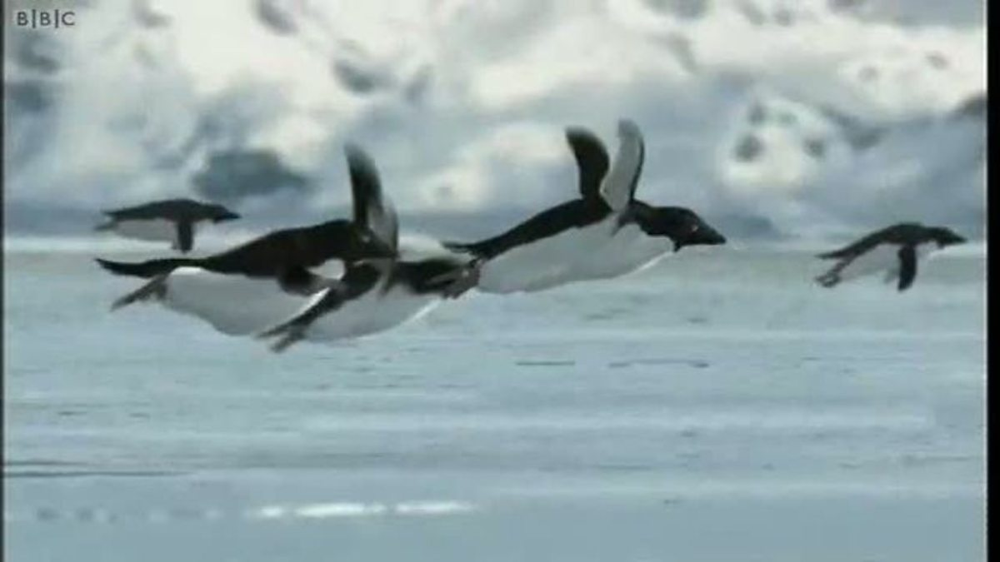

#Sarah

##Penguin Myths
They say penguins can't fly. That's not true.


**Proof that penguins can fly**


##Penguin flight variability by island

Penguins flight varies by island based on wing length. Penguins from Biscoe are the best at flying. Check out how long their wings are.

```{r flight, echo = FALSE}
library(ggplot2)
data(penguins)
ggplot(penguins, aes(x = island, y = flipper_length_mm)) + geom_boxplot() +
  xlab("Breeding colony") + ylab("Flipper length (mm)") +
  ggtitle ("Variability in penguin flipper length by breeding colony")
```
